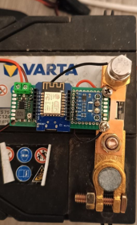
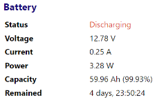
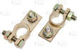
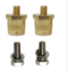
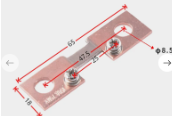

Wireless NMEA0183 Battery monitor
=================

</td>

The idea of the project is to build a battery charge monitor that can be installed into the power system without the need to change the existing electrical wiring. The monitor shunt is installed directly on the negative terminal of the battery and has a second pin for connecting the usual negative terminal. Thus, to install the monitor, you simply need to remove the negative terminal, install the device and return the terminal to the shunt pin.
The device transmits measured current and voltage data using the NMEA018 protocol via WiFi. This data can be displayed in any device or application that supports XDR message, such as Navmonitor or OpenCPN. A built-in web page is also implemented, which displays the current battery parameters

</td>

This data can be displayed, for example, as a widget on the Android screen. Average battery performance statistics are collected per minute and per hour. Averaged data is stored for 7 days and displayed in the form of graphs via a web page - this functionality needs improvement!

The project is based on the code of the following projects:

https://github.com/alvra/nmea-bridge - read the annotation to understand all the capabilities of the device.

https://github.com/ttlappalainen/NMEA0183 - XDR message processing has been additionally implemented

Components:
----------
1. Battery terminals

</td>

2. Pins for terminals

</td>

3. 100A shunt

</td>

4. ESP8266 WeMos D1 Mini V2 (ESP-12)
5. INA226 CJMCU-226 board
6. Power converter TZT MH-MINI-360
7. 3x7 breadboard, terminal block, wires

Assembling the device
  ----------
  * The INA226 board has an address selection pad that must be pre-soldered. The current version of the program is configured to use address 0x45, i.e. it is necessary to solder A0 and A1 to the VCC pin. See the INA226 board datasheet for details. It is also necessary to remove resistor R100 from the board since an external shunt is used instead. The current configured board parameters are:
  shunt 100A / voltage drop across shunt 0.75v, board address 0x45
  * The 3x7 breadboard is secured with screws directly to the shunt; simply drill holes on the board to a diameter of 4mm

Connection diagram here
https://oshwlab.com/aleck1/Nmea-Wreless-Battery-Monitor

TODO
----------
It is necessary to completely rewrite the send_graph_page_response() function, which is responsible for displaying a web page with graphs. Now it's terrible. Charts should not use external libraries and require Internet access to display.
